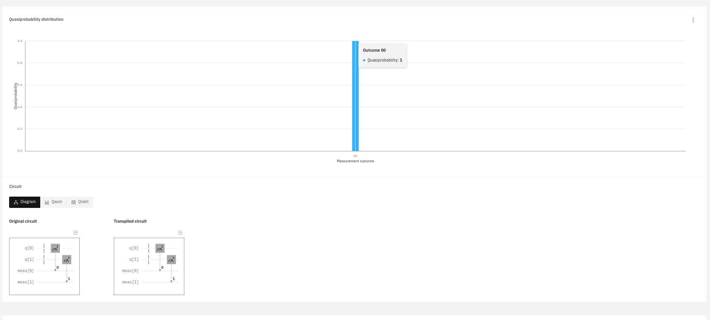
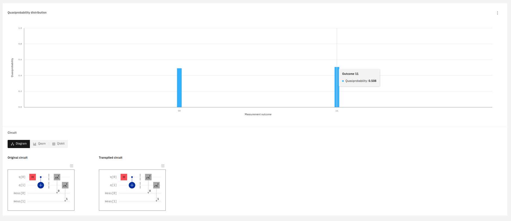
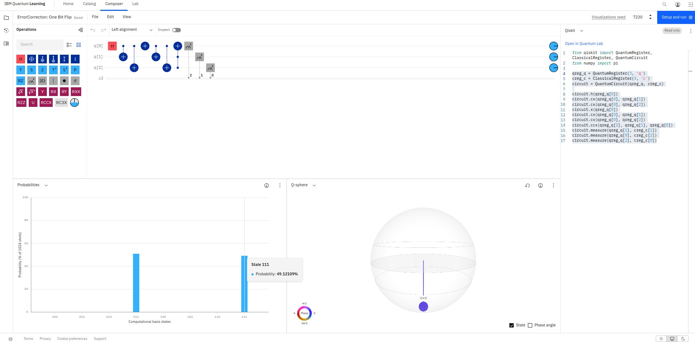
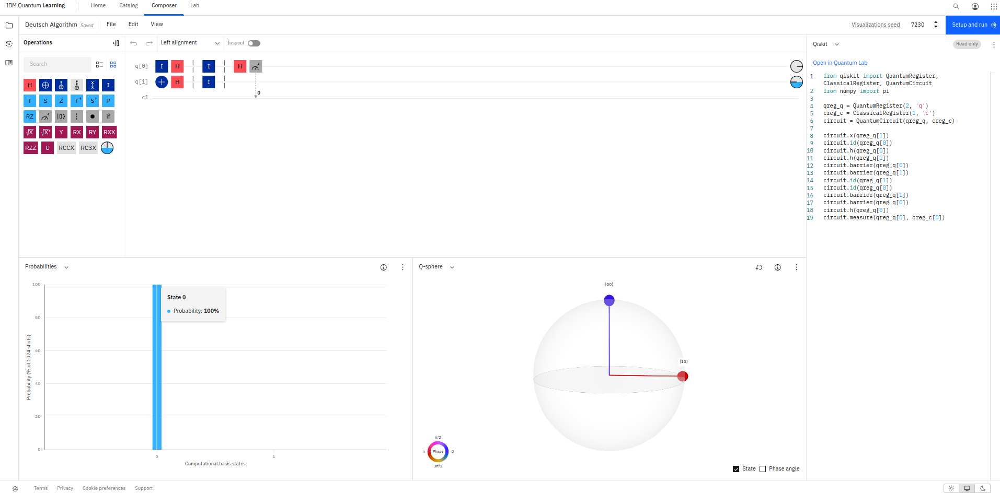

## Introduction to Quantum Computing

[Playlist - Introduction to Quantum Computing](https://www.youtube.com/watch?v=c0D8X4eN_Cg&list=PLnK6MrIqGXsJfcBdppW3CKJ858zR8P4eP)

## First Example

## XOR Example

## Error Correction Example

## Deutsch Algorithm

